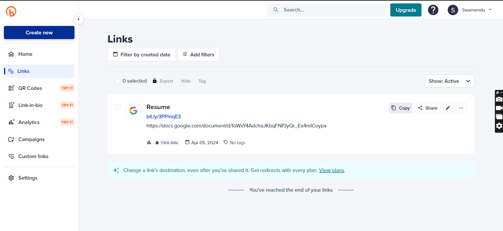
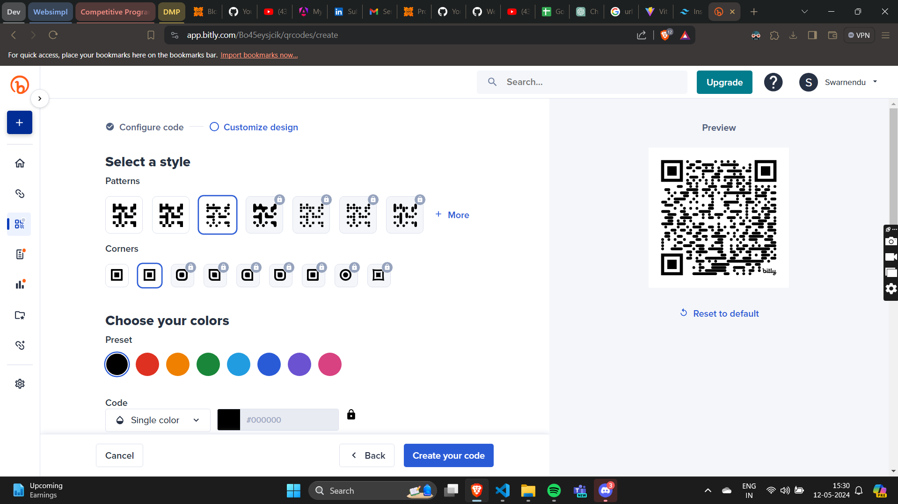

# Click Matrics

## Introduction
Click Matrics is a URL shortening and analytics platform designed to streamline the process of generating short URLs, creating QR codes, and tracking detailed analytics for each link. With Click Matrics, users can easily create short URLs for their long links, share them confidently across various channels, and gain valuable insights into the performance of their links through comprehensive analytics.


## Features
- **URL Shortening:** Clickly  shorten any long URL into a concise and shareable format.
  
<!--  -->
- **QR Code Generation:** Generate QR codes for each shortened URL, enabling easy offline sharing and tracking.
  
<!--  -->
- **Analytics Dashboard:** Gain access to detailed analytics for each shortened URL, including click-through rates, geographical distribution of clicks, referral sources, and more.
- **Customization:** Customize shortened URLs with user-defined aliases for better branding and recognition.
- **Real-time Updates:** View analytics data in real-time, allowing users to monitor the performance of their links as they happen.
- **Exportable Reports:** Export analytics reports for further analysis or sharing with stakeholders.

## Getting Started

### To run locally, follow the given steps:
1. Clone the repository
```
$ git clone https://github.com/oxiton-foundation/click-metrics.git
```
2. Change directory
```
$ cd click-metrics
```
3. Navigate to client folder
```
cd client
```
4. Install npm dependencies
```
npm i
```
5. Run
```
npm run dev
```
6. Then go to
```
http://localhost:5173/
```

### To get started with Click Matrics, follow these steps:
1. **Sign Up:** Create an account on Click Matrics to access all features.
2. **Shorten URLs:** Paste your long URLs into the provided field and generate short links instantly.
3. **Generate QR Codes:** Download QR codes for each shortened URL to facilitate offline sharing.
4. **Track Analytics:** Access the analytics dashboard to monitor the performance of your links and gain insights into audience behavior.
5. **Customize URLs:** Optionally, customize shortened URLs with user-defined aliases for enhanced branding.
6. **Export Reports:** Export analytics reports for further analysis or sharing.

## Technologies Used
Click Matrics is built using the following technologies:
- Frontend: React
- Backend: Node.js, Express.js
- Database: MongoDB
- QR Code Generation: QR Code Generator API
- Analytics Tracking: Google Analytics API

## Contributing
We welcome contributions from the community! If you'd like to contribute to Click Matrics, please follow these guidelines:
- Fork the repository and create a new branch for your feature or bug fix.
- Go to [Contributing.md](CONTRIBUTION.md) to learn how to start contributing.
- Ensure that your code adheres to our coding standards and conventions.
- Submit a pull request detailing the changes you've made and any relevant information.

## License
Click Matrics is licensed under the `MIT License`. See the [LICENSE.md](LICENSE.md) file for more information.
